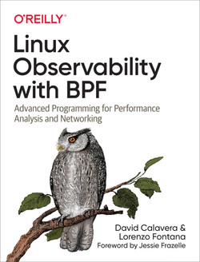

# Learning BPF

该项目是 BPF 的示例代码

# Books

[](https://www.oreilly.com/library/view/linux-observability-with/9781492050193/)

# Prerequisites

```bash
apt install \
    clang \
    gcc-multilib \
    libbpf-dev \
    linux-tools-common \
    linux-tools-generic \
    linux-tools-`uname -r` \
    libbpfcc-dev \
    llvm-dev \
    systemtap-sdt-dev
```

## Catalog

* `hello` 第一个 bpf 程序，并使用 `libbpf` 开发了一个简单的加载器
* `hello-map` 使用 bpf map 在内核与用户空间传递数据
* `hello-bcc-python` 使用 BCC Python 前端来加载 BPF 程序
* `hello-bcc-cxx` 使用 BCC C++ 前端来加载 BPF 程序
* `hello-uprobe` BPF 用户空间探针程序，测量 a.out 的 main 函数执行时间
* `hello-usdt` BPF 用户静态定义跟踪点程序